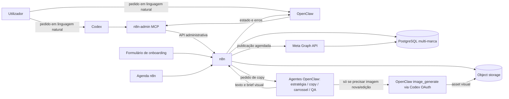

# Plano Técnico — Automação Social com IA

> O código-base local já existe. A ligação OpenClaw, o provider de texto e a infraestrutura n8n/Meta ainda aguardam configuração e credenciais.

## 1. Decisões técnicas recomendadas

| Área | Decisão do piloto | Razão |
|---|---|---|
| Orquestração | n8n auto-hospedado | Executa agendas, filas, armazenamento, publicação, retries e registos sem depender do Codex. |
| Gestão por agentes | Um servidor MCP `n8n-admin` partilhado por Codex e OpenClaw | Acesso administrativo à API pública completa da instância pela credencial de administrador, mais ferramentas directas para workflows e execuções. |
| Ligação ao Codex | Plugin privado Codex que aponta ao MCP `n8n-admin` | Disponibiliza as mesmas ferramentas MCP nesta superfície; OpenClaw liga-se directamente ao mesmo servidor. |
| Copy e estratégia | Agentes especialistas no OpenClaw | Produzem estratégia, legendas e narrativa de carrosséis sem invocar Codex; o provider/modelo OpenClaw é configurado à parte. |
| Geração de imagem | Ferramenta `image_generate` do OpenClaw com `openai/gpt-image-2` e OAuth Codex | Usa o plano existente e os limites incluídos, sem `OPENAI_API_KEY`; só é chamada para imagem. |
| Texto dos agentes | Provider separado do OAuth Codex | Copy e estratégia não consomem a quota Codex reservada para imagens. A configuração depende de provider disponível no OpenClaw. |
| Rede social | APIs oficiais Meta Graph API | Publica numa Página Facebook e numa conta profissional do Instagram. |
| Dados | PostgreSQL | Guarda marcas, posts, aprovação, agenda, estados e tentativas. |
| Ficheiros | Object storage compatível com S3, privado | Guarda materiais e imagens; cria URL temporário só para a Meta obter a mídia. |
| Revisão | Opcional por marca ou a pedido | O modo normal é autónomo; a revisão humana não bloqueia a rotina geral. |
| Repositório | Código MIT versionado no GitHub, sem segredos nem mídia | Permite versionar e duplicar; autenticação Plus, tokens Meta e dados dos clientes ficam fora do repositório. |
| Vídeo | Montagem opcional de Reel a partir de imagens/clips autorizados com FFmpeg | A API de vídeo Sora foi retirada; não há geração de vídeo via API OpenAI para usar neste desenho. |

## 2. Componentes



## 3. Repositório e execução

Estrutura já iniciada no repositório local (código MIT; destino GitHub ainda por configurar):

```text
social-content-automation/
  README.md
  LICENSE
  PRD - Automação de Conteúdo Social com IA.md
  Plano Técnico - Automação Social com IA.md
  Tasks - Automação Social com IA.md
  implementation/
    .env.example
    plugins/n8n-control/      # servidor MCP stdio, manifests e skill Codex
    openclaw/                 # coordenador, 5 papéis, skill e exemplo de equipa
    n8n/README.md             # contrato dos workflows a provisionar pela API
```

- Usar a imagem oficial do n8n; não fazer fork do núcleo do n8n para este caso.
- O n8n e o OpenClaw podem correr numa VPS privada ou num computador/servidor sempre ligado. Se correrem localmente, esse equipamento tem de ficar ligado e ter ligação à Internet no horário previsto.
- O MCP é uma ponte comum: Codex e OpenClaw conectam-se ao mesmo `n8n-admin-mcp`; o MCP chama a API pública do n8n com a chave administrativa. O utilizador não precisa montar os nós manualmente no painel.
- O conjunto de ferramentas MCP cobre ciclo de vida de workflows, execuções, activação/pausa, consulta de logs e gestão operacional permitida pela API n8n.
- Agentes especialistas OpenClaw tratam de estratégia, textos, briefs visuais, carrosséis e QA. n8n chama o OpenClaw por integração HTTP/webhook e recebe o resultado num callback; `image_generate` via Codex OAuth só é chamado para geração/edição de imagem.
- A autenticação OAuth fica no armazenamento privado do OpenClaw, fora do Git, n8n e dos workflows. Pedidos de imagem são serializados; copy, agendamento e publicação não dependem dessa autenticação.
- O OAuth do OpenClaw é guardado no host confiável e nunca corre a partir de uma pasta do repositório. Não versionar tokens, `auth.json`, credenciais n8n, materiais de clientes ou mídia gerada, mesmo num repositório privado.
- O código e os workflows exportáveis podem ir para GitHub sob MIT depois de seleccionar owner/repo; a configuração de execução e os dados de clientes continuam fora do repositório.

## 4. Acesso partilhado ao n8n por MCP

1. Hospedar `n8n-admin-mcp` junto da instância ou num endpoint privado alcançável por Codex e OpenClaw; se a ligação exigir HTTPS remoto, usar autenticação e túnel privado em vez de expor o painel/API n8n sem protecção.
2. O servidor MCP expõe `n8n_api_request` para qualquer endpoint documentado da API pública, além de ferramentas directas (por exemplo `workflow_create`, `workflow_update`, `workflow_activate`, `workflow_execute`, `execution_list`, `execution_get`, `workflow_pause`, `workflow_delete` e gestão de credenciais). Não aplicar allowlist de recursos ou de métodos que limite a administração da instância ligada.
3. Empacotar a ligação como plugin privado do Codex com configuração do servidor MCP; ligar OpenClaw directamente ao mesmo endpoint `n8n-admin` em `mcp.servers`.
4. Configurar os agentes principais com acesso administrativo à API pública completa da instância ligada, incluindo gestão de workflows, execuções, credenciais e outros recursos publicados, sem aprovação por chamada. Pedidos manuais feitos daqui pelo Codex podem contar para o uso normal da sessão; os processos recorrentes no n8n não chamam Codex, excepto para criar/editar imagens.
5. Guardar a API key do n8n e tokens nos stores de segredos dos hosts/servidor MCP, nunca em prompts, workflow JSON ou GitHub.
6. A instância n8n deverá ser privada, controlada pela agência. A API pública de n8n aceita API keys; a disponibilidade e scopes variam por edição, e chaves não Enterprise podem dar acesso amplo a todos os recursos. A chave usada por ambos deve ser criada só para essa instância.
7. Fazer uma prova técnica que crie um workflow de teste, o edite, active, execute, leia a execução e o remova. Depois ligar Codex e OpenClaw ao mesmo MCP e verificar que ambos executam a mesma ferramenta.

Codex e OpenClaw são agentes ligados ao mesmo servidor MCP e partilham capacidade administrativa no n8n. OpenClaw coordena a operação diária. Uma instrução directa enviada nesta conversa Codex para usar o MCP pode contar para a utilização normal da sessão; execuções recorrentes do n8n não acordam Codex, excepto para tarefas visuais. Nenhum deles depende de o utilizador desenhar blocos no editor visual.

## 5. Uso do Codex Plus apenas para imagens

### Execução prevista

1. Autorizar o provider OpenAI do OpenClaw com o fluxo de login OAuth Codex, sem introduzir uma API key paga.
2. Configurar `agents.defaults.mediaModels.image.primary` como `openai/gpt-image-2`; não definir esse modelo como provider dos agentes de texto.
3. Agentes de estratégia/copy/arte entregam o brief e pedem `image_generate` apenas quando falta um asset adequado ou é necessária edição.
4. OpenClaw guarda o resultado no armazenamento de mídia acessível ao n8n e devolve o asset ao workflow.
5. Copy, QA textual, agendamento e publicação não passam pelo Codex. Sem quota ou OAuth, usar asset aprovado ou aguardar material manual.
6. O n8n guarda o resultado e segue automaticamente para publicação ou para revisão opcional da marca.

### Limites e segurança

- A geração integrada usa o limite geral do Codex Plus e pode consumir o limite mais rapidamente. A quota Codex é reservada para geração/edição de imagem; não usar chave da OpenAI API neste caminho.
- O job de imagem pára em caso de falha de autenticação ou de quota; agendas, copy e publicações de outras contas continuam. Não muda automaticamente para uma API paga.
- O token OAuth é equivalente a uma palavra-passe e fica só no armazenamento privado do OpenClaw. Não o enviar ao n8n, ao GitHub, a clientes, ou dentro dos ficheiros de workflow.
- O primeiro marco visual é confirmar uma geração e gravação de imagem com OAuth Codex, sem chave de API. Separadamente, confirmar que jobs de copy e publicação não invocam `image_generate`.
- Se a prova não funcionar de modo fiável ou a quota acabar, usar uma imagem já aprovada ou pedir que o utilizador carregue uma imagem produzida manualmente no ChatGPT Plus. Copy, agenda e publicação continuam sem parar e não mudam para API paga.

## 6. Workflows n8n

### `01-intake`

- Webhook POST autenticado para submissão inicial ou actualização de dados.
- Validar campos obrigatórios, limites de tamanho, extensões e MIME type.
- Guardar materiais com prefixo estável por marca e `asset_id`.
- Guardar configuração da marca no PostgreSQL.
- Responder com confirmação e ID da submissão.

### `02-generate-copy`

- Schedule Trigger consulta posts devidos para geração, ou recebe uma instrução do Codex/OpenClaw pelo MCP.
- Recolher o perfil de marca, factos aprovados, posts recentes e ficheiros de referência.
- Criar `job_id` determinístico e obter lock para não iniciar geração duplicada.
- Chamar os agentes de estratégia/copy/carrossel/QA do OpenClaw, sem invocar Codex.
- Validar estrutura, marca, idioma, factos, variantes por canal e ausência de duplicados.
- Guardar texto e brief visual; avançar para imagem, revisão opcional ou publicação.

### `03-generate-image`

- Chamar `image_generate` do OpenClaw via OAuth Codex apenas se o brief pedir imagem nova ou edição; se não, usar asset aprovado.
- Serializar jobs visuais, gravar o asset e relacionar com `brand_id`, `account_id` e `post_id`.
- Compor logótipo, preços, contactos e texto exacto fora do gerador, usando template gráfico.
- Se a quota falhar, usar asset aprovado existente ou deixar apenas essa publicação à espera de imagem; não interromper outros posts.

### `04-review-optional`

- Por omissão, o fluxo segue sem revisão humana; se uma marca pediu revisão, enviar pré-visualização e pedido assinado.
- Permitir aprovar, pedir revisão aos agentes OpenClaw, rejeitar ou voltar à publicação.
- Não solicitar revisão para alterações normais de workflows executadas pelos agentes.

### `05-publish`

- Schedule Trigger pesquisa posts autónomos cuja hora chegou, ou executa sob comando explícito do agente.
- Obter lock transaccional por post/canal e criar registo de tentativa.
- Criar URL de mídia temporário de leitura para a Meta.
- Publicar no Instagram profissional pela Content Publishing API; publicar na Página Facebook pela Graph API.
- Guardar resposta, ID externo, hora, canal e estado; nunca marcar como publicado só com base numa resposta parcial.
- Em falha, guardar erro e classificar como recuperável ou não recuperável. Retry limitado e idempotente; avisar o administrador.

### `06-error-notifications`

- Capturar falhas n8n/MCP, provider OpenClaw, quota/autenticação de imagem Plus, token Meta, mídia rejeitada e agenda.
- Pausar apenas o job, conta ou marca afectados; n8n continua processos independentes.
- Avisar Codex/OpenClaw com contexto técnico suficiente para diagnosticar e corrigir, sem vazar segredos nos logs.

## 7. Agentes especialistas OpenClaw

- **Operador/orquestrador:** interpreta pedidos, escolhe marca e workflow, administra a instância n8n pelo MCP e encaminha trabalho aos especialistas.
- **Estratega de marca:** converte site, materiais e objectivos em pilares, campanhas e calendário editorial específicos de cada marca.
- **Copywriter:** cria hooks, legendas por plataforma, CTA e hashtags; escreve em português de Angola quando essa for a configuração e mantém consistência de voz.
- **Director de arte e especialista de imagem:** cria conceito, enquadramento e brief visual; decide se basta asset existente ou se deve chamar `image_generate` via OAuth Codex.
- **Especialista de carrossel:** constrói história slide a slide, hierarquia de informação, copy breve, CTA final e indicação visual por slide.
- **QA editorial:** valida factos contra fontes da marca, ortografia, idioma, tom, repetição, legibilidade e requisitos do formato.

O MCP não é apenas de consulta nem fica limitado a workflows. O agente operador recebe acesso a todos os recursos e métodos expostos pela API pública da instância n8n da agência, inclusive alterações/remoções de workflows, execuções e gestão de credenciais, sem confirmação por operação. As autorizações OAuth da Meta continuam a exigir uma ligação inicial à conta proprietária.

O uso do provider/modelo OpenClaw para copy tem limites ou custos próprios, conforme a conta configurada; fica separado da quota Codex Plus, reservada para imagens.

## 8. Modelo de dados mínimo

| Entidade | Campos principais |
|---|---|
| `brand` | `id`, `name`, `website_url`, `voice`, `locale`, `timezone`, `schedule`, `enabled` |
| `brand_fact` | `id`, `brand_id`, `fact`, `source_asset_id`, `approved_by`, `approved_at` |
| `social_account` | `id`, `brand_id`, `platform`, `platform_account_id`, `credential_ref`, `timezone`, `schedule`, `enabled` |
| `asset` | `id`, `brand_id`, `storage_key`, `media_type`, `source`, `rights_confirmed`, `created_at` |
| `post` | `id`, `brand_id`, `scheduled_at`, `caption_by_channel`, `visual_brief`, `review_mode`, `status` |
| `post_account` | `id`, `post_id`, `social_account_id`, `caption`, `media_assets`, `status` |
| `publication` | `id`, `post_account_id`, `attempt`, `external_id`, `status`, `error_code`, `published_at` |

Estados do post: `RECEIVED → COPY_READY → IMAGE_READY → SCHEDULED → PUBLISHING → PUBLISHED`, com saídas opcionais `NEEDS_REVIEW`, `REVISION_REQUESTED`, `REJECTED`, `FAILED` e `PAUSED`.

## 9. Publicação Meta

- Instagram deverá ser Business ou Creator. No percurso Facebook Login, a conta profissional deve estar ligada a uma Página; a API não publica em contas pessoais de Instagram.
- Pedir apenas as permissões necessárias para identificar a Página e a conta Instagram e publicar conteúdo. A ligação da app, modo de teste e permissões de produção serão configurados com a conta administradora.
- Usar nó Facebook Graph API do n8n quando cobrir a operação; usar HTTP Request para operações específicas de publicação Instagram não cobertas pelo node.
- A mídia deve estar acessível à Meta durante a ingestão. Preferir URL pré-assinado temporário, em vez de deixar o bucket público indefinidamente.
- Validar separadamente formato, proporção, tamanho e duração do formato escolhido contra os requisitos vigentes dos endpoints antes do primeiro post de produção.
- Publicação autónoma é o modo pretendido; revisão fica configurável por marca/conta. Horários, idioma, tipo de conteúdo e limites diários são independentes por conta.

## 10. Geração de flyers e precisão visual

- Só `image_generate` via OAuth Codex cria/edita o asset visual de base; não redige copy nem opera workflows.
- O agente visual OpenClaw cria brief e decide se é necessária uma nova geração ou se um asset existente serve.
- Para texto de flyer, telefone, URL, preço e CTA, compor o texto exacto sobre a imagem num template SVG/HTML/FFmpeg após geração. Rever manualmente a primeira série; a geração de imagem pode errar texto pequeno ou composição rígida.
- Guardar a origem do material (foto real fornecida, imagem gerada no Plus, composição final) para gestão editorial e decisões de divulgação.
- Só usar fotografias, vídeos, pessoas, música e marcas de terceiros quando o utilizador confirmar que há autorização de uso.

## 11. Vídeo

- Não prometer geração automática de clipes sintéticos via OpenAI: a documentação oficial indica que a Videos API e os modelos Sora API foram retirados em 24/09/2026.
- Primeira alternativa automatizável: montar Reel vertical curto com fotografias/clips autorizados, imagem criada no Plus, movimento simples, títulos e logótipo com FFmpeg; áudio só se fornecido ou licenciado.
- Alternativa com geração genuína no Plus: gerar o vídeo manualmente na interface disponível para a conta e carregá-lo pelo formulário; o n8n trata aprovação e publicação. Disponibilidade de vídeo depende dos recursos activos na conta e região e não é assumida pelo MVP.
- O post de vídeo só entra no workflow de publicação depois de validar a especificação actual do endpoint Instagram e Facebook escolhido.

## 12. Multi-marca e licença

- O sistema nasce multi-marca: uma instância n8n e workflows-base gerem várias marcas/contas com isolamento por IDs; agentes podem criar ou adaptar workflows por MCP.
- Separar assets, publicações, configuração e credenciais por marca/conta. Nunca reutilizar tokens entre clientes.
- OpenClaw e Codex recebem acesso administrativo apenas à instância n8n ligada; adicionar outra instância exige ligação MCP própria.
- A n8n descreve-se como fair-code e publica sob Sustainable Use License. A documentação de licenciamento alerta para restrições quando a agência aloja workflows e credenciais de clientes na sua própria instância. Antes de centralizar vários clientes, rever os termos actuais com a n8n ou escolher instância própria do cliente/licença adequada.
- O operador da agência não precisa editar nós no painel; onboarding e mudanças solicitadas são executados pelos agentes via MCP.

## 13. Referências técnicas

- [Geração de imagem integrada no Codex/ChatGPT e utilização do limite do plano](https://learn.chatgpt.com/docs/image-generation)
- [Planos ChatGPT, Codex CLI e cobrança de API em separado](https://learn.chatgpt.com/docs/pricing)
- [Autenticação Codex ChatGPT em infraestrutura privada e persistente](https://learn.chatgpt.com/docs/auth/ci-cd-auth)
- [Modo não interactivo do Codex](https://learn.chatgpt.com/docs/non-interactive-mode)
- [OpenAI — criar um servidor MCP para Codex](https://developers.openai.com/plugins/build/mcp-server)
- [OpenAI — empacotar um plugin com configuração MCP](https://developers.openai.com/plugins/build/plugins)
- [OpenClaw — ligar servidores MCP](https://docs.openclaw.ai/tools/mcp)
- [OpenClaw — inbound webhooks para activar um agente](https://docs.openclaw.ai/automation/cron-jobs/webhooks)
- [n8n — autenticação da API pública e permissões](https://docs.n8n.io/api/authentication/)
- [n8n — referência da API pública](https://docs.n8n.io/api/api-reference/)
- [Instagram Graph API — Meta](https://www.postman.com/meta/instagram/documentation/6yqw8pt/instagram-api)
- [Facebook Graph API — Meta](https://www.postman.com/meta/facebook/documentation/r56bjfd/facebook-api)
- [n8n Facebook Graph API node](https://docs.n8n.io/integrations/builtin/app-nodes/n8n-nodes-base.facebookgraphapi/)
- [n8n Webhook node](https://docs.n8n.io/integrations/builtin/core-nodes/n8n-nodes-base.webhook/)
- [n8n Sustainable Use License](https://docs.n8n.io/sustainable-use-license/)
- [n8n — licenciamento para alojamento de workflows e credenciais de clientes](https://support.n8n.io/article/can-i-use-your-license-for-my-use-case)
- [Meta — rótulos para conteúdo gerado por IA](https://about.fb.com/news/2024/02/labeling-ai-generated-images-on-facebook-instagram-and-threads/)
- [OpenAI — descontinuação da Videos API/Sora API](https://developers.openai.com/api/docs/deprecations)

## 14. Ligações

- [[PRD - Automação de Conteúdo Social com IA]]
- [[Tasks - Automação Social com IA]]
